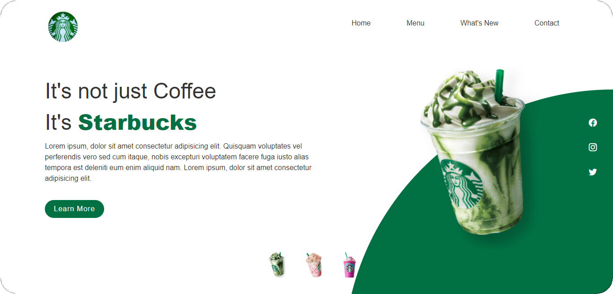
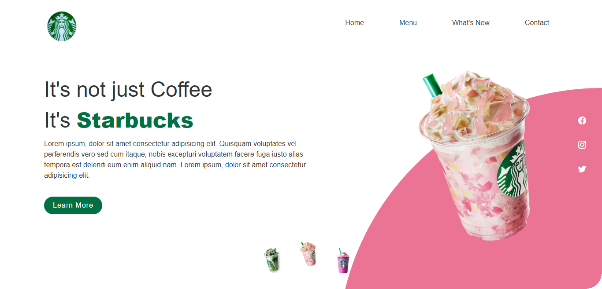
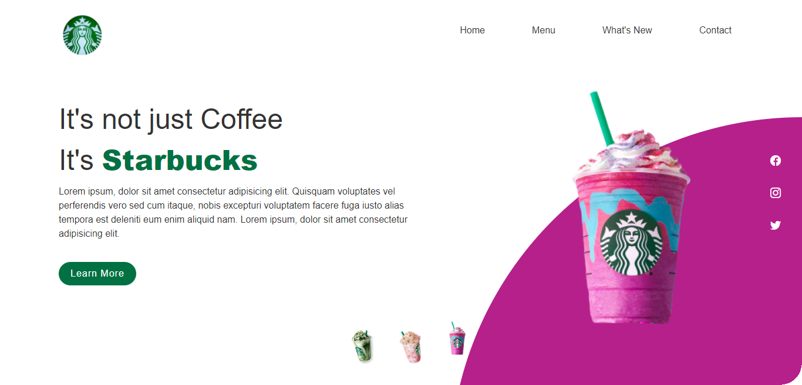

#Starbucks Model

 
##Information
---

This is a Starbucks template site, made solely for testing. The other pages and button functionality will be created soon.

**The page consists of:**

* HTML
* CSS
* Javascript.
 

##Site View
---

    

        

            

                <figure>
                    
                </figure>
                

                    <ul class="thumb">
                        <li>
                            
                        </li>
                        <li>
                            
                        </li>
                        <li>
                            
                        </li>
                    </ul>
                

            

        

    

